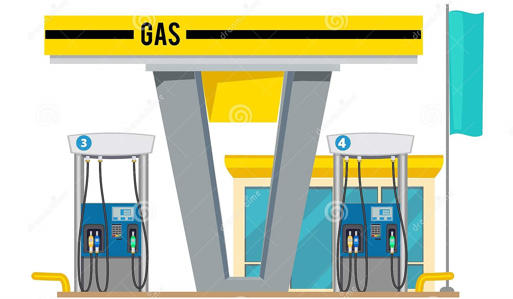

# Petroleum Gas Price Analysis using Python: A Case Study of the United States and Europe from 1994 to 2025

**Michael Cox | Texas A&M University | March 8, 2022 | Modified as of December 27, 2024**

Stock image (https://www.dreamstime.com/illustration/cartoon-gas-pump.html)

## Abstract

This project is an analysis of gas prices in the United States and Europe. The data was collected from the U.S. Energy Information Administration (EIA) and the European Commission. The data was then cleaned and analyzed to show the average gas prices in the U.S. and Europe. The data was then visualized using matplotlib and seaborn to show the trends in gas prices over time. The data was also analyzed to show the correlation between gas prices in the U.S. and Europe. The results show that gas prices in the U.S. and Europe are correlated, but the correlation is not perfect. The data also shows that gas prices in the U.S. and Europe have been increasing over time. This project is a good example of how data analysis can be used to understand trends in gas prices and how they are related to each other. Future reproduction of this project can be done by updating the data and re-running the analysis to see how gas prices have changed over time, specifically with global events such as the Russia-Ukraine conflict and the COVID-19 pandemic.

This project has been modified using current data as of December 27, 2024 and projected data up to 2025. Future updates can be done by updating the data and re-running the analysis to see how gas prices have changed over time.

I plan on using this project as reference and template for future data analysis projects, specifically for the housing market in the US and Europe. I will use this project as a reference for how to clean and analyze data, as well as how to visualize data using matplotlib and seaborn. I will also use this project as a reference for how to write a report on data analysis and how to present the results of the analysis.

## Data Sources

**1. Energy Information Administration** (https://www.eia.gov/dnav/pet/hist/LeafHandler.ashx?n=pet&s=emm_epm0_pte_nus_dpg&f=m)

**2. European Environment Agency** (https://www.eea.europa.eu/data-and-maps/daviz/nominal-and-real-fuel-prices-6/#tab-chart_1)
